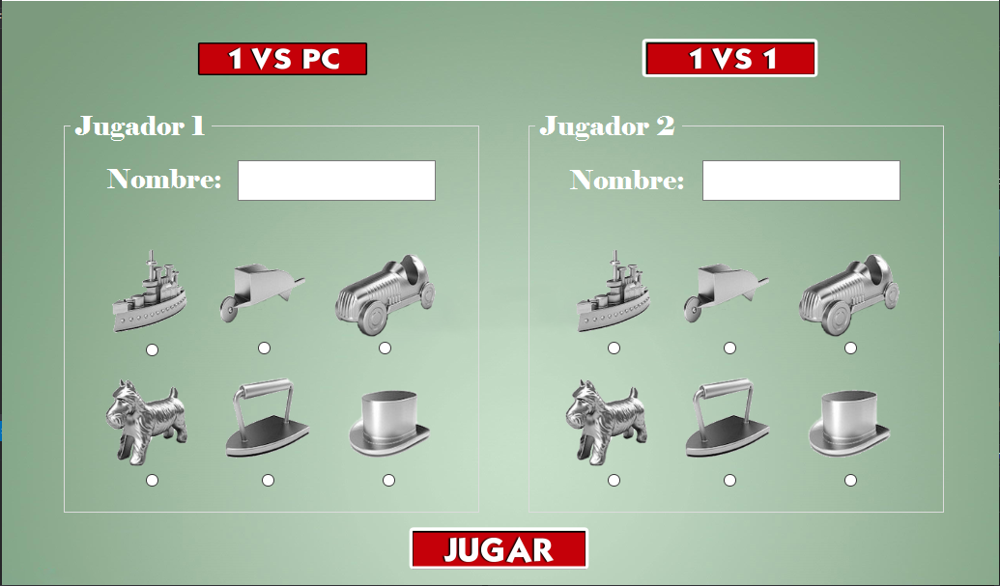

# Monopoly UPC

### Virtual Monopoly developed as a final project for the course of Discrete Mathematics at UPC. This was made using the following concepts:

- Boolean matrices
- Linear transformations
- Directed graphs 
- Relations.
---
#### Screenshots:

#### Made by <a href = "https://github.com/RodrigoAGM">@RodrigoAGM </a>
